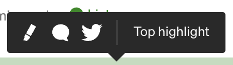

# Coding A Medium Article

The article I'm working on today is [How I built my Startup as a solo developer by Sushrit Pasupuleti](https://medium.com/@sushrit.pk21/how-i-built-my-startup-as-a-solo-developer-8561bf7eebde)
You can find the [full live version here](https://coding-this-medium-article-ep1.netlify.app/).

## Why Am I Doing This? 🤷🏾‍♂️
During the course of taking a deeper dive into HTML, primarily through taking courses by [Jen Kramer](https://www.linkedin.com/in/jen4web/) on [LinkedIn Learning](https://bit.ly/3VkpvwB) I realised that a lot of the HTML I had been writing before was simply just <strong>a coat hanger for my CSS</strong>. It was there simply to provide the content for my CSS to be able to style. I didn't really give much thought to things like <strong>accessibility, structure, semantics</strong>, choosing to care more about just having a live version of my build that <em>looked</em> right. 

So, I've decided to stop trying to speedrun through complex projects that will only further establish that shakey foundation, and instead take on smaller projects that would allow me to be more <em>intentional</em> with my code.

For this project, I decided to code three [Medium](https://medium.com/) articles, which I believe, although not enough to solidify the new things I have learned about semantic HTML into my coding brain, it would most definitely be <strong>good practice</strong>, and something that I can update if needs be the more I learn, and also provide me a <strong>template to refer to in future builds</strong>.

## What I Would've Done Differently
- I was unable to get the link tags to fit the width of the menu linlks container in the main nav so to overcome this issue I just gave them borders to give them more surface area for people to click on, however, I would've liked a better solution for this that's more robust and dynamic.  

## Fixes (or at least what I believe to be fixes)
I've been using Medium for a long time but never actually thought about the minor issues on the site, whether it be spacing issues, or hover interactions. I'm not saying that I'm anywhere near the level of the people working on the site, but I did make some minor tweaks that I think although noticeable to the majority of viewers unless you analyse the design of the website, still were tweaks that would improve the design as a whole.

 <!--Edit this on Photoshop and show a side-by-side comparison of yours and theirs-->
- There were some minor spacing issues between the tooltip icons, so I used the flexbox layout and gap to solve this. 

## Some things I Learned in the course of doing this 👨🏾‍💻
- OG Tags - which are tags used to control the display of a URL when shared on social media. [Learn more about OG Tags here](https://ahrefs.com/blog/open-graph-meta-tags/)
- If you are writing a period of time, for example 5 minutes, you would need to prefix the datetime value with PT which stands for Period (P) and Time (T). This specifies that the period only consists of time and not a date. [More on how to use the time tag to represent durations in this article](https://stackoverflow.com/questions/51168022/what-does-pt-prefix-stand-for-in-duration)
- You have to have a good memory to be a good coder. If you forget that you had a margin on all your ul elements for example, you may get frustrated when you find that you can't align the a specific ul to the end of the it's container. 
- You can use text-align to center not only text and images but also HRs 
- Don't only use em for widths and spacing, use rem if you want consistent spacing for saying margins on bigger elements, or sizes of bigger elements, but if you want to for example make a buttons padding responsive to it's particiular font size then use em. It also makes it easier for you to calculate how what you're actually doing. Because if you know the base font is 16px or 10px, etc. then you can easily calculate what 2rem is or what 1.5 rem, and spacing things out becomes a lot less like guess work.

## Some questions I had based on the project
- I was unable to load multiple fonts in my CSS. I got the fonts from the Medium website by using [this method](https://www.makeuseof.com/how-to-find-webpages-font-inspect-element-tool-browser-extensions/#:~:text=Go%20to%20the%20webpage.,fonts%20used%20on%20the%20webpage.), but was unable to load the Sohne font for the heading text properly for some reason. Any ideas?
- Should the mini-article components in the More from Medium aside be wrapped in article tags?

